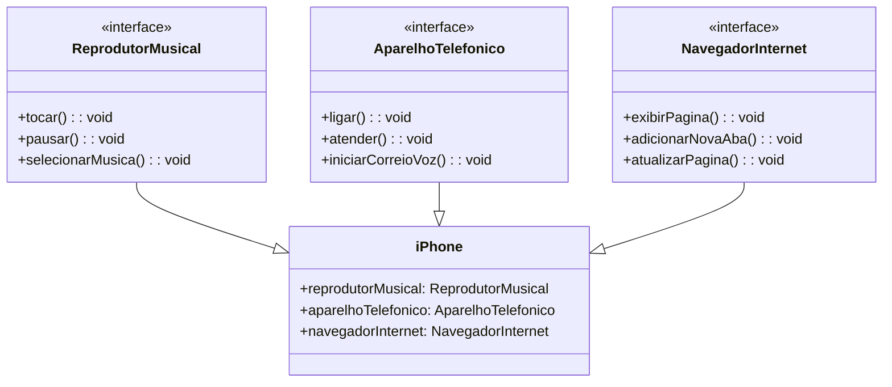

# Desafio-Iphone-DIO

## Resolução do desafio 
<a href="https://github.com/digitalinnovationone/trilha-java-basico/tree/main/desafios/poo">Desafio de projeto</a> da
<a href="https://www.dio.me/bootcamp/coding-future-gft-aws-desenvolvimento-java-com-cloud-aws" rel="nofollow">DIO</a>

Diagrama e projeto em Java criado com base no video do desafio de projeto de POO do Bootcamp Santander Java 2023.
Neste video mostra o lancamento do Iphone com várias funções como: Reprodutor de músicas, Navegação na Internet... Uma revolução 
pra época.

